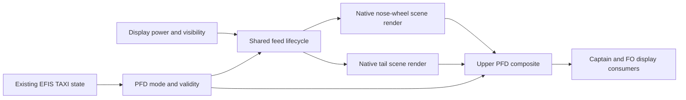

# Historical SDK research

Recorded on 12-13 September 2026. This assessment preserves earlier findings and implementation checkpoints; its statements that camera delivery or EFIS integration are unfinished are historical. See the [current project state](../README.md) and [development history](../DEVELOPMENT_HISTORY.md). Aircraft source paths below identify the external aircraft inspected on those dates, not files or build requirements of this repository.

# A380X taxi camera: MSFS 2024 SDK feasibility

Research dates: 12–13 September 2026. This records the feasibility assessment and implementation checkpoints; no live taxi-camera feed has been demonstrated.

## Finding

The public SDK documents camera control, but this research did not establish a supported way to supply two simultaneous, independent views of the live simulator scene to a cockpit instrument while the pilot's cockpit view stays active. That rendering contract is the dependency to resolve before implementing the requested feature.

The A380X already handles the EFIS TAXI button and publishes its selection state. The separate native **0.7.4 probe is installed** after passing combined validation and exact-binary ReShade smoke tests. The user confirms substantially improved simulator FPS; the armed PFD still receives no camera images. The preceding 0.7.1 confirmed **768 × 255 / 768 × 504** native output size fields, but produced zero captures, compositions and PFD stamps with candidate **11839** armed. That live CPU measurement exposed repeated memory-region queries as the dominant observer cost. Version 0.7.2 reduces that cost and expands native copy observation, but neither published source matches the observed copy/transition path yet. This remains an experimental build-specific path, with EFIS wiring and aircraft-mounted camera geometry unfinished. An additional user-selectable exterior viewpoint would not satisfy the requested in-display composite.

The subsequent read-only publication snapshot identifies the actual registered outputs as **29265/29266**, respectively **768 × 255 / 768 × 504**, both **R11G11B10_FLOAT** with advancing RTV-associated draw observations. The user reports the PFD state adapter ready with 787 observed lists and zero hook failures. Installed **0.7.3** adds that color format and capture after a submitted batch, but its live test still delivered no images and reported `unknown_source_state`. [Live evidence](../discovery/findings.md#native-072-live-result)

Version **0.7.4 was installed, but its live A380 test still delivered no images**. Both sources retained `initial_model=1` and source draws exceeded 85,000; the submitted-state tracker nevertheless reported `unknown_source_state`. Its combined build, actual ReShade pixel tests and exact-binary loading test had passed; installed SHA256 is `93B1E37009E2C101ED065BDDD87383E308F4A60D7932F0757A3196907CBAF876`. **0.7.5 is installed**, addressing ReShade's unregistered immediate submission and publication loss during refresh. Combined validation and installation of 0.7.5 passed; live validation is pending. [Latest checkpoint](../discovery/findings.md#native-074-live-failure-and-075-source-checkpoint)

This conclusion concerns the documented public interfaces inspected. It does not prove that the engine lacks internal render-to-texture functionality or that a private partner interface cannot exist.

Inspection of the installed Aerosoft A340 establishes a concrete alternative: native WASM MapView imagery combined with prepared aircraft-image overlays. It provides a camera-style approximation with different scene content from a second full-scene camera render. The user considers those limitations significant and has asked about private renderer access; that investigation is assessed below. The current JavaScript synthetic-vision interfaces remain another possible approximation, but are not the interfaces identified in Aerosoft's installed gauge.

## Requested result and visual interpretation

The user's requirements are an EFIS TAXI activation button, a combined nose-wheel and tail-camera view in the upper PFD, live MSFS 2024 imagery, and high performance while taxiing.

The supplied photograph is a visual reference, not an instruction source or an aircraft systems specification. It suggests a narrow nose-wheel pane above a larger tail pane, with lower display information retained. It does not establish exact lens geometry, overlay dimensions, electrical supply, failure indications, activation limits, or automatic reversion rules. Those require A380 technical references before production behavior is implemented.

## What the SDK establishes

| Capability | Evidence and consequence |
| --- | --- |
| Camera control in released MSFS 2024 | Sim Update 5, version 1.7.27.0, released on 30 April 2026, added the Camera API for SimConnect and WASM. This is not merely an unreleased proposal. [Release notes](https://www.flightsimulator.com/release-notes-sim-update-5-1-7-27-0-now-available-msfs-2024/) |
| Add-on camera ownership and positioning | The retail API lists acquisition/release, position/orientation/FOV settings, camera definitions, flags, status notifications and world-loading controls. It remains marked API beta; retail availability and API stability are separate issues. No independent camera-render-target creation or image-delivery function was found in that API. [Camera API](https://docs.flightsimulator.com/msfs2024/retail/programming-apis/simconnect/api-reference/camera/camera-api/) |
| Reading camera data | `FsCameraData` carries settings such as position, reference frames, target, rotation and FOV. It provides no image buffer or texture handle. `CameraGet` must not be interpreted as frame capture. [FsCameraData](https://docs.flightsimulator.com/msfs2024/retail/programming-apis/wasm/camera-api/fscameradata/) |
| Camera flags | The documented flags are `NONE`, `INTERACTION` and `ABOVE_GROUND`. Enabling a flag is not a documented way to start a taxi-camera video stream. [FsCameraFlag](https://docs.flightsimulator.com/msfs2024/retail/programming-apis/wasm/camera-api/fscameraflag/) |
| Official camera sample | `CameraAircraft` displays camera status and names on gauges, and demonstrates a fly-by and camera-definition selection by moving the user's view. It does not demonstrate video inside those gauges. [CameraAircraft](https://docs.flightsimulator.com/msfs2024/retail/samples-tutorials/samples/simobjects-aircraft/modularaircraft/cameraaircraft/) |
| Existing gauge output | `panel.cfg` defines gauge placement and the material receiving the panel output. `render_on_screen` places panel output on the user's screen. Neither establishes a source for live scene imagery. No camera-input entry was found in the inspected retail or flighting panel references. [Retail panel.cfg](https://docs.flightsimulator.com/msfs2024/retail/content-configuration/cfg-files/panel.cfg/), [flighting panel.cfg](https://docs.flightsimulator.com/msfs2024/flighting/content-configuration/cfg-files/panel.cfg/) |

Asobo's Camera API discussion describes one dedicated add-on camera with ownership arbitration. Requests for simultaneous independent views, including taxi cameras, are requests rather than supported interfaces. Asobo's 17 February 2026 reply says multi-monitor behavior changes were not planned at that point. That is dated context, not a guarantee about future releases. [Asobo discussion and reply](https://devsupport.flightsimulator.com/t/camera-api-discussion/17193?page=2)

### The `CameraToTexture` documentation trap

Search-indexed content for the old `html/5_Content_Configuration/CFG_Files/cameras_cfg.htm` reference lists `CameraToTexture` as a category. The inspected current retail and flighting `cameras.cfg` references omit it from the category list. Direct access to the old URL failed during this research. An enum name alone supplies no texture binding, lifecycle, resolution, or composition contract. [Current retail cameras.cfg](https://docs.flightsimulator.com/msfs2024/retail/content-configuration/cfg-files/cameras.cfg/), [current flighting cameras.cfg](https://docs.flightsimulator.com/msfs2024/flighting/content-configuration/cfg-files/cameras.cfg/)

The current documentation navigation also contains a Camera Screens And Mirrors link whose target could not be retrieved. This is a lead to clarify, not evidence of working support. Asobo announced a documentation migration on 7 July 2026 and acknowledged broken links during the transition, so inaccessible documentation must not itself be treated as proof that a feature is absent. [Documentation migration announcement](https://devsupport.flightsimulator.com/t/new-documentation-url/18146)

Do not invent `camera00` panel entries or a JavaScript camera texture API from those names. The next useful evidence is an official working sample, matching installed SDK headers/documentation, or an explicit supported-interface answer from Asobo.

### Synthetic vision: a supported API worth testing

The current MSFS 2024 avionics framework exposes `BingComponent.set3DMapCameraTransform(pos, altitudeRef, offset, rotation, rotationRef)` in `EBingMode.HORIZON`. It supports custom position, meter offsets and rotation, with aircraft-following position when `pos` is null. Offsets use the rotated camera's coordinates, so existing cameras.cfg XYZ values cannot be copied blindly. The method provides a concrete route to explore synthetic nose/tail viewpoints. It does not document a full-scene camera feed with own-aircraft geometry and ground traffic. [BingComponent](https://microsoft.github.io/msfs-avionics-mirror/2024/docs/api/@microsoft/msfs-sdk/classes/BingComponent/#set3dmapcameratransform)

The component has configurable resolution and vertical FOV. Its `sleep()` method is documented as stopping component-driven changes to the bound Bing instance; that is not a promise to suspend GPU rendering. [Bing properties](https://microsoft.github.io/msfs-avionics-mirror/2024/docs/api/@microsoft/msfs-sdk/interfaces/BingComponentProps/), [Bing lifecycle](https://microsoft.github.io/msfs-avionics-mirror/2024/docs/api/@microsoft/msfs-sdk/classes/BingComponent/#sleep)

The WASM MapView API separately exposes terrain/aerial/altitude/weather map rendering into NanoVG textures. Its documented object limit is nine concurrent MapViews, with at most 2048 pixels per axis. These are map-renderer limits, not evidence of nine full-scene cameras or a camera-feed frame-rate control. [MapView API](https://docs.flightsimulator.com/msfs2024/retail/programming-apis/wasm/mapview-api/mapview-api/), [MapView creation](https://docs.flightsimulator.com/msfs2024/retail/programming-apis/wasm/mapview-api/fsmapviewcreate/), [MapView size](https://docs.flightsimulator.com/msfs2024/retail/programming-apis/wasm/mapview-api/fsmapviewsetsize/)

A small HORIZON probe is one possible experiment after verifying the repository dependency supports the method. It must test actual wheel/airframe visibility, animated steering, nearby obstacles, pavement markings, night illumination and frame times. A separate aircraft overlay can provide an Aerosoft-style approximation, as described below; that choice must retain a clear distinction between map imagery and a full live scene feed.

The repository declares `@microsoft/msfs-sdk` as `^2.3.0` in the root package.json and locks it to **2.3.3** in pnpm-lock.yaml. Current online documentation must not be assumed to match that locked version. Verify the transform/FOV interfaces against the chosen package before an intentional dependency update. No dependency was changed for this research.

No `BingComponent` or HORIZON construction site was found in the A380/shared source inspected. The shared EFB has a legacy React Bing map wrapper and traffic code also binds a map, but neither is a ready-made FSComponent PFD camera. A JavaScript experiment should use an isolated FSComponent probe and measure runtime map allocation alongside existing consumers; source call-site counts do not establish the remaining instance budget.

## Installed Aerosoft A340: concrete implementation evidence

The user's installed Community entry `aerosoft-aircraft-a346-pro` is a symbolic link to:

`C:/Users/rober/Aerosoft One Library/Add-ons/msfs-eb54-AS16881/gameDirectory~Community/aerosoft-aircraft-a346-pro/`

The following findings came from read-only inspection of that installation. No Aerosoft code or assets were copied into this repository, and the add-on was not modified or executed.

### Ground image source

Aerosoft explicitly identifies its taxi camera as an MSFS Map API feature. Its helpdesk explains that the background uses satellite imagery; missing or displaced taxiway markings can result from the imagery at a particular airport. This independently establishes the image source. [Aerosoft product description](https://www.aerosoft.com/en/shop/flight/microsoft-flight-simulator/msfs-2020/msfs-aircraft/4763/aerosoft-aircraft-a340-600-pro), [Aerosoft taxi-camera support article](https://helpdesk.aerosoft.com/hc/en-gb/articles/34566087604893--A340-600-Pro-Taxi-Camera-not-correctly-showing-taxiways-in-the-Aerosoft-A340-600-Pro)

The import table of `SimObjects/Airplanes/airbus-a346-pro/panel/MSFS_ToLiss_Plugin.wasm` contains these native functions:

- `fsMapViewCreate`, `fsMapViewSetViewMode`, `fsMapViewSet3D`
- `fsMapViewSet3DViewOrientation`, `fsMapViewSet3DCustomViewOrientationInRadians`
- `fsMapViewSetVisibility`, `fsMapViewDelete`
- The `fsRender` texture/drawing functions, including `fsRenderCreateTexture` and `fsRenderTriangles`

It also contains the taxi texture path `./data/display data/TaxiCam.png` and a diagnostic mentioning a synthetic-vision MapView overlay. These observations identify native WASM MapView use in the gauge, rather than the JavaScript `BingComponent.set3DMapCameraTransform()` interface. Imports alone do not identify each call's runtime purpose, parameters or scheduling; the module also draws other aircraft instruments.

### Aircraft and wheel imagery

`data/display data/TaxiCam.png` was visually inspected in place. It is a prepared image atlas containing a tail-view fuselage cutout, multiple wing-shape variants, a collection of nose-wheel views at different steering angles, and a magenta guidance mark.

Combined with the module's reference to the asset and Aerosoft's stated map background, this strongly supports a composition of map imagery plus aircraft sprites. Selecting wheel/wing variants according to aircraft state is the natural interpretation of the atlas, but the exact selection and animation rules were not traced. The asset does not establish that any surrounding live vehicles or scenery models are rendered.

### Cockpit composition and version evidence

`SimObjects/Airplanes/airbus-a346-pro/panel/panel.cfg` instantiates `MSFS_ToLiss_Plugin.wasm` with `wasm_gauge=NanoVGInstruments` for PFD/ND/ECAM and other displays, placing them in a 4096 by 4096 `$GAUGES_UNIFIED` texture atlas. Interior glTF metadata contains the corresponding gauge mesh/material. This establishes the native gauge-to-cockpit output path. The dollar-prefixed material is an observed configuration in this installation, not a recommendation for the A380's native 2024 package.

Version metadata disagrees: `manifest.json` reports **1.0.1**, while `data/version.txt` reports **V1.0.3**. The conclusions here refer to the files actually inspected, not a confidently identified release. Aerosoft's current product history separately lists a native FS24 migration and SU5 taxi-camera fix in 1.0.3; later published versions do not establish what is installed here.

### Consequence for the A380 investigation

A native WASM MapView underlay, composed with independently created A380 wheel/fuselage imagery and FSComponent indications, is the concrete approximation established by this inspection. It would explore the same API family found in the installed Aerosoft implementation, without depending on a JavaScript SDK upgrade. Existing A380 ND native/HTML gauge layering offers a package-integration precedent. It does not resolve the user's subsequent request for a complete live scene through private renderer access.

Create the A380 assets from project-owned source and drive steering/wing presentation from the aircraft's own state. First validate map perspective, imagery alignment, current-simulator compatibility, display composition and performance. The installed imports and image atlas do not reveal exact camera offsets, FOV, render size, view count, update rate, texture sharing, activation cost or measured frame times. Those remain experiments, not values to assume.

## Existing A380X integration

All source paths below are relative to `fbw-a380x/`. Line numbers refer to the checkout inspected on the research date.

| Area | Existing source and integration implication |
| --- | --- |
| EFIS button | `src/base/flybywire-aircraft-a380-842/SimObjects/AirPlanes/FlyByWire_A380X/attachments/flybywire/Part_Interior_Cockpit/model/behaviour/efis-cp.xml:38` sends `A32NX.FCU_EFIS_{L\|R}_TAXI_PUSH` and reads the matching TAXI annunciator variable. The TAXI instance at line 194 has an INOP tooltip; it still sends the event. |
| Input handling | `src/wasm/fbw_a380/src/interface/SimConnectInterface.cpp:713` registers the left event, with the right event at 739; the handlers feed the respective FCU TAXI push inputs. |
| Selection state | `src/systems/shared/src/publishers/EfisCpBusPublisher.ts:53` documents TAXI as bit 16 in EFIS discrete word 2. Topics `fcu_efis_l_discrete_word_2` and `fcu_efis_r_discrete_word_2` already expose the words. The FCU already owns the toggle; adding another toggle would duplicate state. |
| PFD runtime | `src/systems/instruments/src/PFD/instrument.tsx:111` already registers that publisher. `PFD/tsconfig.json`, its parent configuration, and `mach.config.js:37` establish FSComponent as the JSX runtime. Use SDK subjects, subscriptions and lifecycle methods. |
| Display partition | `src/systems/instruments/src/PFD/PFD.tsx:219` contains the display content. `PFD/LowerArea.tsx:37` puts the lower-area separator at SVG y=157.7 of 211.6. On the 768 by 1024 gauge, this is approximately y=763, leaving approximately 261 pixels below. Preserve that lower content and review the separately rendered pitch-trim display. |
| PFD materials | The cockpit attachment's `panel/panel.cfg:51` maps the PFDs to `SCREEN_DU_PFDL` and `SCREEN_DU_PFDR`, using `duID=0` and `duID=3`. These are gauge-output materials, not camera feeds. |
| Existing composition precedent | The ND entries in the same panel file combine a WASM terrain gauge and an HTML gauge. This demonstrates the repository's use of layered gauges, but does not establish camera-texture compatibility. A PFD underlay would also require deliberate changes to its opaque SVG background and masks. |
| Display lifecycle | `src/systems/instruments/src/MsfsAvionicsCommon/CdsDisplayUnit.tsx:230` controls power/brightness/boot visibility. CSS hiding alone does not prove native camera rendering stops. The renderer needs an explicit activity signal. |
| Geometry starting points | `common/config/cameras.cfg:1352` under the aircraft SimObject defines `FixedOnPlane_TailCamera`; line 1386 defines `FixedOnPlane_LandingGear`. These are selectable user views. Their differing origins and lens settings need conversion and calibration before they can serve as ETACS camera geometry. |
| Existing feature inventory | `README.md:91` lists ETACS as inoperative due to a simulator limitation. That local note is consistent with the unresolved rendering contract, but is not independent proof of the current SDK's limits. |

For selection, use the correct side's ARINC word with the existing ARINC consumer pattern and validity handling, such as `bitValueOr(16, false)`. Preserve subscription destruction and avoid fresh per-frame SimVar polling.

There is a side-index naming hazard: the local PFD helper maps raw DU IDs 0/3 to PFD indices 1/2, while the helper in `CdsDisplayUnit.tsx` returns raw DU IDs. Use an explicit mapping for captain/FO selection. Test both sides separately.

The generated FCU model already calculates TAXI state. Do not edit generated WASM model sources for this integration.

## Proposed rendering architecture, conditional on SDK support

The preferred design is two native scene renders feeding a composite upper display, with FSComponent handling the selection state, borders and indications. Camera production should be owned once per aircraft and shared by the captain and FO displays if the SDK permits sharing.

The native render and composition boxes above describe requirements, not verified available API calls. Whether the final output is a native underlay with transparent HTML overlays or an SDK-provided HTML image surface must follow the supported binding contract. The existing ND implementation only offers a structural example.

## Minimum evidence before renderer implementation

1. Identify the exact simulator build, installed SDK version, and repository build-container SDK headers. Retail and flighting documentation must not be mixed into an assumed common API.
2. Obtain a supported sample or interface that renders one physical aircraft-mounted camera into a cockpit gauge while the pilot remains in the cockpit. In parallel, a small Bing HORIZON experiment can resolve whether its imagery meets the requirement. Verify animated own-aircraft geometry, nearby pavement markings and ground objects in either route.
3. Extend that isolated sample to two different views at the same time. Demonstrate nose-wheel and tail viewpoints; verify no view switching or capture of the pilot's current screen is involved.
4. Show that both feeds can appear in the upper PFD region with the lower region retained. Check alpha composition, orientation, aspect ratio, night lighting, captain/FO operation and pop-outs/VR where supported.
5. Prove that the feeds can stop when no active display needs them, and can recover after power changes, flight reloads and source failure. A failed or stale feed needs a defined indication; derive final aircraft behavior from technical references.
6. Measure the performance matrix below. Only then connect the production renderer to the existing EFIS bit and remove relevant INOP labeling.

If step 2 has no supported full-scene solution, exact live-camera fidelity remains blocked at the platform interface. The Aerosoft-style MapView/overlay route can still be implemented and assessed as an approximation; its map-quality and scene-content limitations must be evaluated against the user's taxiing needs.

## Performance experiment

These are proposed experiment settings, not SDK capabilities or measured results:

- Start at approximately the actual upper display resolution, rather than rendering full desktop-sized camera images. Trial 20 and 30 updates per second only if independent scheduling is exposed.
- Prefer native GPU texture production and composition. Avoid CPU readback, image encoding, network transport and per-frame image uploads as the primary path.
- Compare camera off, nose only, tail only, both feeds on one PFD, and both feeds on both PFDs. This reveals whether display duplication also duplicates scene renders.
- Record CPU/main-thread and GPU frame times, frame-time spikes, memory use, image latency and image clarity. Repeat at the same busy airport, lighting, weather and traffic settings; include cockpit and VR runs where available.
- Verify off-state cost explicitly. A hidden HTML element does not establish an inactive render pass.

Small images still require scene preparation, culling and potentially extra world content. Asobo discussed those costs in 2022; that historical explanation motivates measurement but supplies neither a current benchmark nor an acceptable cost for this A380 implementation. [Asobo rendering-cost explanation](https://devsupport.flightsimulator.com/t/define-additional-virtual-cameras-which-can-be-rendered-to-a-gauge-for-aircraft-which-use-cameras-in-real-life-e-g-a380-a350-taxi-and-tail-camera/3089/28)

## Private renderer access and the WASM boundary

An ordinary C/C++ WASM gauge cannot directly dereference arbitrary simulator process addresses or call native Direct3D functions. MSFS compiles WASM ahead of time into native DLLs, but explicitly excludes Windows API access. WebAssembly retains isolated linear memory and validated function calls; ahead-of-time compilation does not grant ordinary native-plugin privileges. [MSFS WebAssembly](https://docs.flightsimulator.com/msfs2024/retail/programming-apis/wasm/webassembly/), [WebAssembly security model](https://webassembly.org/docs/security/)

There is an important distinction between a private engine function and an undocumented WASM host import. The latter could be callable if MSFS exposes it with a compatible signature. Merely declaring an unknown function in C is insufficient: MSFS must resolve its import when compiling the module, otherwise validation fails. No host-callable full-scene render-to-texture interface has been established by this research. [MSFS module linking and validation](https://docs.flightsimulator.com/msfs2024/retail/programming-apis/wasm/debugging-webassembly-modules/)

The repository's root `CMakeLists.txt` confirms the `wasm32-unknown-wasi` target. Its existing terrain gauge maps NanoVG rendering callbacks to host-provided `fsRender` functions. Native-looking C++ and graphics helper functions do not remove that boundary.

### Separate native Windows integration: theoretical architecture

A separate native component is a different research avenue. Its feasibility depends on discovering usable engine interfaces, rather than on writing a new WASM camera class. Two independent capabilities must be demonstrated:

1. **Produce another complete scene view.** This needs the engine's current world and aircraft state, camera setup, scene visibility/LOD decisions, render scheduling and output target. Intercepting `Present` only reaches presentation of an already rendered image. It cannot reveal unseen scenery or request a new viewpoint. Those additional engine requirements are an architectural inference from graphics pipeline operation, not verified MSFS extension points. [DXGI Present](https://learn.microsoft.com/en-us/windows/win32/api/dxgi/nf-dxgi-idxgiswapchain-present), [Direct3D 12 pipeline state](https://learn.microsoft.com/en-us/windows/win32/direct3d12/managing-graphics-pipeline-state-in-direct3d-12)
2. **Deliver the resulting GPU texture into the cockpit display.** D3D12 supports shared resources and synchronization, but participating native components still need a binding mechanism. The documented WASM `fsRenderCreateTexture` and `fsRenderUpdateTexture` interfaces take image byte pointers, not native GPU resource/shared handles. No standard public GPU-texture import into a WASM gauge was found. A desktop overlay also does not establish a texture on the PFD's 3D cockpit material. [D3D12 shared handles](https://learn.microsoft.com/en-us/windows/win32/api/d3d12/nf-d3d12-id3d12device-createsharedhandle), [fsRenderCreateTexture](https://docs.flightsimulator.com/msfs2024/retail/programming-apis/wasm/low-level-api/functions/fsrendercreatetexture/), [fsRenderUpdateTexture](https://docs.flightsimulator.com/msfs2024/retail/programming-apis/wasm/low-level-api/functions/fsrenderupdatetexture/)

The proposed division would keep EFIS selection, display lifecycle and indications in the existing aircraft systems/FSComponent layer, while an independently established native integration owns the two scene renders and their texture bindings. GPU texture production and composition should remain on the GPU for the performance experiment. Sending rendered images through CPU readback and WASM texture uploads would introduce additional copies and synchronization; no frame-rate claim is justified before measurement.

### Discovery gates

First seek an existing private host import, partner interface or engine render-to-texture path with a demonstrable call contract. An internal camera name, symbol or address alone is insufficient. If a separate native route is pursued, prove one additional live scene camera while the cockpit remains active, and independently prove an animated test texture can reach the actual PFD material. Only after both demonstrations should work extend to two cameras, captain/FO sharing and the performance matrix above.

This route would be an unverified native renderer integration project with simulator-version coupling, render-thread/lifetime failure risks and a Windows-specific deployment requirement. It is not a capability supplied by compiling C to WASM. No private interface was invoked, no running process memory was accessed, and no injection or native prototype was implemented during this assessment.

## Implementation attempt: installed host-interface audit, 13 September 2026

After the user requested implementation of the private/native route, a static inspection checked for a usable interface before adding a renderer or modifying the PFD. The installed simulator is under `C:/XboxGames/Microsoft Flight Simulator 2024/Content/`. Both `MicrosoftGame.Config` and `appxmanifest.xml` identify version **1.8.16.0**.

The following files were read without loading or executing their code:

| File | Observed evidence |
| --- | --- |
| `UtilityLib.wasmlib` | A native Windows COFF archive with 862 indexed symbols across 20 object members. Includes `WasmExtensionCamera_Proxy.obj`, `WasmExtensionMapView_Proxy.obj` and `WasmExtensionLLVG_Proxy.obj`. Camera symbols cover acquisition, configuration, definitions, status and world lockers. MapView and `fsRender` symbols match the previously documented map and gauge-drawing families. |
| `innative-env.wasmlib` | A native runtime archive with memory, stack, atomics and Windows import-library support. These native runtime dependencies do not establish that an add-on can import arbitrary Windows functions. |
| `SimConnect_internal.dll` | An x64 PE DLL with 118 exported names. Its camera exports cover the existing camera-control API; no scene-output texture operation was identified. |

The proxy archive also contains `InitCamera`, `InitRender`, `InitMapView` and corresponding `real_*` function-pointer records. Their native type encodings include a hidden `WasmModuleHdl_Z` argument. They establish implementation glue, not a new second-camera API or an independently callable render contract. No matching symbols established mirror rendering, offscreen scene rendering, camera-to-texture output or external/shared GPU texture import.

Static reading of `FlightSimulator2024.exe` failed with `EPERM`, including after a sandbox-escalated retry was approved. This was an OS-level read failure, not an automatic approval rejection. File permissions were not changed and no protection was bypassed. The executable's internal renderer was therefore not inspected; absence of relevant symbols in the accessible libraries does not establish absence of internal engine functionality.

No installed SDK was found in the checked standard locations, environment variables or installation records. The repository expects `/workdir/MSFS_SDK` in its pinned Docker image, but the Docker daemon pipe was unavailable. These prevent a local WASM build at present; installing the toolchain alone would not resolve the missing renderer interface.

**Full-scene camera provider status: unresolved.** No private function signature was guessed and no PFD mode was added. The initial missing-interface result did not exhaust the native GPU integration route; the concrete probe below continues that work.

## Native GPU probe implemented, 13 September 2026

The existing ReShade 6.8.0.2155 installation provides a native add-on loading and D3D12 observation path. `../` now implements an explicitly selected display-texture calibration add-on. It forwards supported instrument draws and then writes an animated upper-area pattern through its own RTV descriptor. It does not create a camera or use the WASM sandbox. See the [tool README](../README.md) for exact build, install, controls and limitations.

A portable compiler was provisioned in an ignored workspace build directory. A discovered MinGW/MSVC structure-return ABI mismatch is handled by a small separately compiled Microsoft-ABI C bridge; 28 ABI/layout probes and three incompatible negative controls check this boundary. The add-on avoids ambiguous barrier state reconstruction, indirect/native-pass replay and application descriptor reuse.

The compiled native helper passed hardware and WARP GPU tests: 585,984 upper pixels changed and all 200,448 lower pixels remained unchanged. An isolated test using the installed ReShade DLL also passed registration, device lifecycle and unload. The D3D12 debug layer was unavailable.

The validated add-on was installed as `C:/XboxGames/Microsoft Flight Simulator 2024/Content/taxi-camera-native.addon64`, with calibration disabled by default. The simulator's ReShade log confirmed its registration and D3D12 initialization. The first cockpit test exposed a selection bug caused by changing counter text being included in ImGui item identities. Version 0.2 fixed the identities and clarified the enable control; it was rebuilt, validated and installed.

In the repeated test, candidates 1398 and 1408 painted the ND background beneath its HTML symbology; no tested candidate reached the PFD. The aircraft panel definition places `terronnd.wasm` under the ND HTML gauge, whereas the PFD consists of a separate HTML gauge. The result therefore demonstrates a native background-layer write, not final PFD composition. It does not establish which format, copy/upload path or resource layout hides the PFD from the original narrow filter.

The requested camera region is the entire upper PFD, including FMA, horizon, speed and altitude tapes: `x=[0,768), y=[0,763)`, normalized `u=[0,1), v=[0,0.7451171875)`. The lower 261 rows contain the preserved lower area and trim display. An inset horizon texture or an underlay beneath flight symbology does not satisfy this requirement.

Version 0.3 expands observation to non-depth 2D textures with other formats, mip levels and layers, and counts copies, uploads, native passes and SRV registrations. It adds a calibration path following supported texture copies in the already established `COPY_DEST` state, using immutable upload storage rather than inferred barriers. Upload callbacks with incomplete native information remain observational. It passed 38 ABI probes, 320 geometry cases, 137 metadata checks and both GPU validation hosts on hardware and WARP. The installed ReShade also passed the isolated loading tests. The simulator loaded version 0.3 after installation, confirmed in its log at local 10:45:47. The tool README describes the bounds and checks. PFD identification, final composition, camera scene generation, EFIS integration, dual views and camera performance remain unverified or unimplemented; probe validation must not be presented as those capabilities.

The 0.3 display inventory resolved the immediate UI blocker: six newly visible RGBA8 768 × 1024 textures have five mip levels. Their observed draw counts increased, but the retained single-mip RTV predicate prevented calibration eligibility. Version 0.4 supports each actually bound mip through its own compatible descriptor and scales the camera boundary to that mip's dimensions. The copy path keeps its separate single-mip restriction. All 254 metadata cases, existing validation and the new five-mip GPU test passed on hardware and WARP; 0.4 was installed for the next cockpit test. The user then confirmed that candidate **8404 painted the right PFD** and **8489 painted the left PFD** in that session. Calibration automatically disabled with the **512-write frame-budget** error, including after re-enabling. Native calibration has therefore reached both PFDs, while persistent coverage remains unverified.

Version 0.5 repairs that quota behavior. A shared draw/copy limiter defaults to 4096 batches of five rectangles, configurable from 64 to 16384, and resets on a new device Present callback or after a 50 ms monotonic fallback window. Manual enabling resets the session. Exhaustion keeps calibration enabled and reports throttling through counters and rate-limited diagnostics; original draws and copies continue unchanged. A timed reset can also occur during a slow frame and does not itself prove a missing Present callback. Normal PFD symbology can reappear where later drawing overlaps the calibration during throttling. The warning-as-error build, ABI checks, new budget regression tests, existing hardware/WARP GPU tests and isolated ReShade loading tests passed. Version 0.5 was installed after MSFS exited with verified SHA256 `4FD32E6743A60FAF1AA5C0983A1697091B3C708DE70E3B2E786970F0E7A9CF95`. This change adds no scissor clipping, rendering hook or camera provider.

The subsequent cockpit test confirmed the persistence repair: the user reported **Works**, with **11867 identifying the left PFD** and **11847 identifying the right PFD** in the new session. The simulator log confirms version 0.5, both enable actions at quota 4096, and an advancing Present counter. The attached cockpit screenshot visibly establishes full upper-left-PFD coverage above flight symbology, lower information/trim preservation, and an unaffected adjacent ND. The right-PFD identity is established by the user's report rather than that screenshot. These observations establish a working native display-calibration path in the tested cockpit state; they do not establish simultaneous two-display operation, behavior under deliberate quota exhaustion, live camera generation or camera performance. Resource IDs change across sessions and are not persistent material identifiers.

## Native executable discovery, 13 September 2026

A separate read-only main-image inventory successfully inspected running MSFS 2024 1.8.16.0. The bounded scan read 16 MiB with zero read failures, after verifying the same-user process, executable identity across Xbox path aliases, and loaded PE section bounds. It found `CameraToTexture: Id = %d, (VpId = %d)` at RVA 130434128 and `CCameraToTextureMgr_G` at RVA 133576352. These are genuine internal string references and a useful renderer lead. They do not establish a function signature, object layout, lifetime, supported camera configuration or callable export. No private renderer function has been invoked.

A subsequent bounded static-reference scan found five RIP-relative `LEA` sites referencing those two literals, in four PE runtime-function ranges. LLVM decoding from the declared function boundaries validated instruction alignment; 128 MiB of executable ranges were searched, with 12,921 bytes decoded and no read or boundary-check failures. This establishes code references, not execution, reachability, constructors or render-call contracts. The scan reached its byte cap and is not exhaustive. Detailed findings are kept with the separate discovery tool.

Further bounded inspection traced the private manager's entry initializer, creation and erasure paths, mode-zero pose-key lookup, and output material construction. The observed native resource chain is material diffuse bitmap → bitmap backend record → record offset 16 resource wrapper → wrapper offset 168 pointer used in D3D12 resource barriers. The camera erasure path removes its manager entry but queues viewport retirement; it does not establish GPU completion. These findings apply to the inspected executable build only. [Detailed evidence and limits](../discovery/findings.md) and [entry ownership](../discovery/camera-entry-contract.md) are recorded separately. The A380's existing tail/landing-gear GUIDs have not yet been matched to the private pose keys.

At this checkpoint, the independently tested components were a Win64/SSE update observer, a mock-validated two-entry controller and a D3D12 compositor. Hardware and WARP each passed six changing frames, 4,718,592 pixel checks and exact preservation of the lower PFD rows. Subsequent checkpoints below connect these components; those original standalone tests did not demonstrate a simulator camera feed.

## Native scene probe 0.6 checkpoint, 13 September 2026

The separate native probe now has a compiled scene-test runtime and explicit ReShade UI controls to request and stop two owned camera-manager entries. **Version 0.6 passed its combined validation and was installed on 13 September 2026. Its first live attempt reached the observer but stopped in source-pose validation before creating cameras.** The previously confirmed 0.5 upper-PFD calibration DLL was preserved as a backup. Version 0.6 SHA256: `C4D6261A98A223E096D73B1C12D924409B691617D5E2A33ECCA9039D3F3BF02D`. [Implementation, validation and limits](../discovery/findings.md#native-scene-probe-06-implementation-checkpoint-13-september-2026)

The new experiment uses mode two to supply a pose outside the manager's two observed built-in pose branches. It clones a validated current-camera pose once and freezes that starting pose for both owned views. The intended result is evidence for private creation, readiness, cleanup and output-pointer discovery. It does not yet position cameras at the A380's nose wheel or tail, follow the aircraft, connect simulator images to the PFD compositor, or establish taxi-camera performance. The loaded A380's inspected mode-zero key table was empty; that result does not demonstrate a GUID byte-order mismatch or missing ordinary external camera presets.

The source validation follows captured code, not assumed SDK coordinate conventions. Getter **70721312** returns the embedded handle address at source+104. Position getter **55910592** resolves its Node and reads translation from the matrix pointer at **Node+296**, offset **+96**. Orientation getter **55910752** uses the **Node+256** Camera payload, checks its type value seven at **+160**, and reads basis rows at **+1648/+1680/+1712**. The helper checks finite translation, a finite near-orthonormal basis and positive finite Camera FOV before the runtime uses the source. Private axes, units and FOV conventions remain unproven; a current-view pose is not established aircraft mounting geometry.

The UI queues requests for the engine's camera-manager update observer. Before creating entries, the adapter checks the current manager lifetime and requires two free slots in the existing eight-view pool, with another capacity check before each creation. Every returned nonzero ID remains owned until a complete table check confirms its removal. Readiness checks match entry/view Node and material references before reporting an optional output resource. The probe does not retain or call that resource, and entry removal does not prove deferred GPU retirement.

The fixed code guard matched 27 ranges in two fresh read-only simulator captures, including bounded relocation metadata checks. Hook tests cover the static vtable's **MEM_IMAGE/PAGE_EXECUTE_WRITECOPY** mapping, Windows' private-page promotion, removal and recovery while preserving execute permissions and CFG target metadata. The combined build, native/ReShade ABI tests, memory/view/lifecycle checks, hardware/WARP GPU tests and isolated ReShade loading all passed; the D3D12 debug layer was unavailable. This is an installed experiment awaiting live verification. EFIS integration, two aircraft-mounted live feeds, resource synchronization, final PFD composition and performance measurements remain outstanding.

The source failure was traced to an unsupported eight-byte alignment condition on a valid engine reference record. Version 0.6.1 corrects the control-record reads without changing the pointer value or removing generation, region, bounds or consistency checks. Two read-only simulator captures passed the complete corrected pose check with 292 bytes and no failures. The replacement add-on passed its combined build, regression, GPU and ReShade loading tests and was installed on 13 September 2026 with its checksum verified and the previous DLL backed up. Camera creation and live output remain unverified. [Alignment evidence](../discovery/findings.md#source-reference-alignment-correction-in-061)

## Native 0.7 source: resized scene views and PFD connection

The preceding **0.6.2** introduced alternating 15 Hz activation requests per camera, capped at 20 Hz. The user then measured approximately **120 → 43 FPS**, with both outputs at **3413 × 913** and serviced probe CPU time of **64.870 ms last / 267.644 ms maximum**. Version 0.7 batches bucket-array reads and rereads, preserving the same bounds and consistency checks while removing thousands of small read calls. The subsequent live result below still shows substantial observer time.

Before first activation, 0.7 keeps both newly created views closed for one original engine update, then reduces each to at most **768 pixels wide** at its inherited aspect ratio—**768 × 205** for the reported dimensions. This warm-up lets the previously empty manager initialize its primary-size cache. The runtime changes only the owned view's verified dimension fields, refreshes projection and uses the engine's existing output size-mismatch/reallocation path. It does not write primary-view dimensions or the manager cache. Two fresh read-only captures match the resulting 29-range code profile; failed checks leave the new views closed for cleanup.

The linked pipeline matches owned outputs to real ReShade lifecycle/copy events, captures GPU snapshots, orders submissions with native queue fences, composes the pair, and draws through the selected-PFD adapter. The result is an opaque **768 × 763** upper region, including flight symbology, while the lower **261 rows** are preserved. After identifying the PFD and starting the scene test, **Enable camera on selected PFD** selects this source independently of calibration. Keep paired rendering enabled; the first-camera-only option is a performance diagnostic. The requested 15–20 Hz limits are activation opportunities, not measured completed frame rates.

All component, hardware/WARP and actual-ReShade pipeline tests pass, including the final combined build and smoke test. **Version 0.7 was installed**, with SHA256 **`35F17285781683135878317C12DA27A92B074332709A7F26493B4F5624301A8E`** verified while MSFS was closed. Release artifacts and receipts are preserved under `tools/taxi-camera-native/build/releases/0.7/`; the prior DLL was backed up. Its simulator log confirms loading at **17:26:47** and D3D12 initialization at **17:26:48**, without logged errors. The live A380 test then confirms **768 × 205** outputs and identity matching, with captured/completed/composed counters all zero and observer CPU still approximately **47–62 ms**. Both views clone and freeze the same current-camera pose; nose-wheel/tail mounts, aircraft following and EFIS TAXI control remain unfinished. [Detailed evidence](../discovery/findings.md#native-scene-to-pfd-07-source-checkpoint)

Version **0.7.1** sets each native view's dimensions to its PFD pane: **768 × 255** and **768 × 504**, with separate projection refreshes before activation. The four-row divider is added only during composition. The live A380 test confirms those native view/output size fields and output association; a matched GPU resource's `GetDesc` and completed camera pixels have not yet independently confirmed them. Capture/composition/stamp counters remained zero with PFD candidate **11839** armed. Serviced observer CPU was **52.250 ms**, of which **196 VirtualQuery calls took 51.548 ms** and **196 RPM calls took 0.649 ms**; later samples were mostly **51–55 ms**. These times exclude the original engine update and GPU execution. Evidence is archived in `tools/taxi-camera-native/build/releases/0.7.1/live-ReShade.log`.

Version **0.7.2** caches region metadata only within each read-only inspection stage, retains every exact RPM field read and full trace reread, and requires fresh endpoint region validation before using a result or calling the engine. Unrelated resource churn preserves a completed handoff but invalidates open inspection tickets. Native `CopyResource`/`CopyTextureRegion` observation runs after the exact original call; the existing generation and submission checks still govern capture. Raw barrier/copy diagnostics cover the observed base method table, with active-pass tables followed only for `EndRenderPass`, so zero counters cannot exclude an unobserved route. Known, already installed active-pass tables use a shared-lock check with two exact eight-byte RPM reads and no VirtualQuery; first installation, unknown tables and protection recovery retain the full safeguards.

Combined 0.7.2 validation passed **8,396 boundary checks**, **56 ABI comparisons**, **18 hardware/WARP capture-manager cases**, **319,957 local-memory checks** and **17,197 handoff checks**, plus actual-ReShade PFD-state/pixel tests and smoke loading. Installation verified SHA256 **`6A6AF4EF6848458268DF6535FC1C5F44E9040B2D3CBA8A89CB2CF0F01EE60080`**, preserving the previous DLL as `taxi-camera-native.addon64.backup-20260913-173526-213`. Receipts are in `tools/taxi-camera-native/build/releases/0.7.2/`, including `installation.json`. **The 0.7.2 live A380 imagery and performance result remains pending.**

## Native 0.7.5 installed checkpoint

The 0.7.4 creation observer succeeded live, but current state proof was later lost. Pinned ReShade commit `18deaa52de0c425a78b329e9cb3c497281cd00ec` creates its immediate command list through the native device without ordinary list lifecycle events (`source/d3d12/d3d12_impl_command_list_immediate.cpp:34`), then submits and resets it natively (`:151`, `:179`). Queue initialization occurs after this list exists (`d3d12_impl_command_queue.cpp:19–30`, `d3d12_command_queue.cpp:22`). The 0.7.5 work registers that known list and observes its native barriers/Reset; pointer replacement after a failed Close requires fresh identity handling. Unknown submitted recordings still invalidate state rather than being assumed harmless.

Completed publication now survives a refresh and unrelated resource churn that invalidates its new inspection ticket. Actual target/device/scene/owner changes still revoke it. This addresses the separate live publication toggle, observed alongside roughly 330 ticket invalidations and only one target invalidation; 18,225 focused handoff checks pass.

The six focused production ReShade cases pass, including a registered immediate list with two flushes/two native resets, four captures and **1,165,824 exact pixels**. Scoped invalidation preserves unaffected source keys and unrelated bundle work; the unknown-submission negative case still refuses capture. **57 ABI comparisons pass.** These local results do not establish that camera images now reach the PFD. **Combined validation and deployment of 0.7.5 passed; live testing remains pending.**

## Focused SDK question, ready to submit

No external message has been sent.

> We are investigating A380 ETACS in MSFS 2024: two simultaneous aircraft-mounted cameras, one viewing the nose wheel and one from the tail, composited into the upper part of a 768 by 1024 PFD while the normal pilot cockpit view stays active. The Camera API appears to control one shared add-on viewpoint. Is there a supported public API or configuration/sample for rendering these two live scene views to instrument textures? Older indexed cameras.cfg documentation mentions CameraToTexture, while the current references do not provide a binding contract. Please identify the required simulator/SDK version, gauge or HTML binding mechanism, support for animated own-aircraft geometry and ground traffic, feed enable/disable and resolution/update controls, and whether textures can be reused on two display units without additional scene renders. If there is no public interface, is this use case covered by an existing SDK request?

## Validation status

The EFIS-to-PFD data path, display runtime, panel configuration and existing camera definitions were inspected in source. Public SDK references and Asobo statements were checked. Native scene creation, pane dimensions, registered output identities and initial RT creation models have live evidence, but installed 0.7.4 still delivered no camera images. Version 0.7.5 is installed; live validation is pending. No local MSFS SDK header validation, aircraft build or TypeScript check was needed for this standalone native change. Aircraft instrument source, generated models and large assets were not changed.

When EFIS/PFD instrument integration is added, run its focused lifecycle tests and lint, and build the PFD with `FBW_TYPECHECK=1`. Package configuration or WASM changes also require the scoped A380 build in the pinned environment and simulator validation. The current native validation command requires `build.ps1 -Validate -ReShadeDll <existing dxgi.dll>`; see the tool README for the complete command.

Version 0.7.5 installation is verified with SHA256 `BFD688FE87E363DE3BFFB69B132EB29C93CABD55D5974EF333B45C6C425E2EC9`. The combined build and exact-binary ReShade loading check passed. Previous DLL backup: `taxi-camera-native.addon64.backup-20260913-192449-080`. Exact artifacts and receipts are in `tools/taxi-camera-native/build/releases/0.7.5/`. Live PFD imagery remains unconfirmed.
